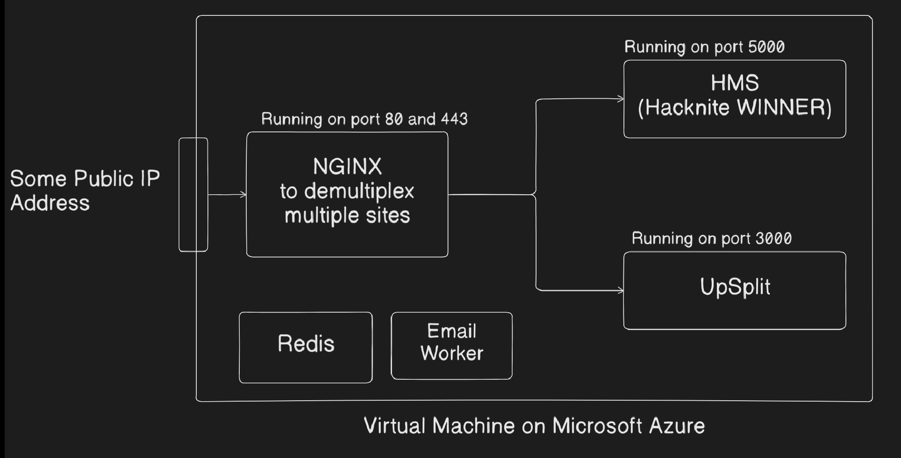
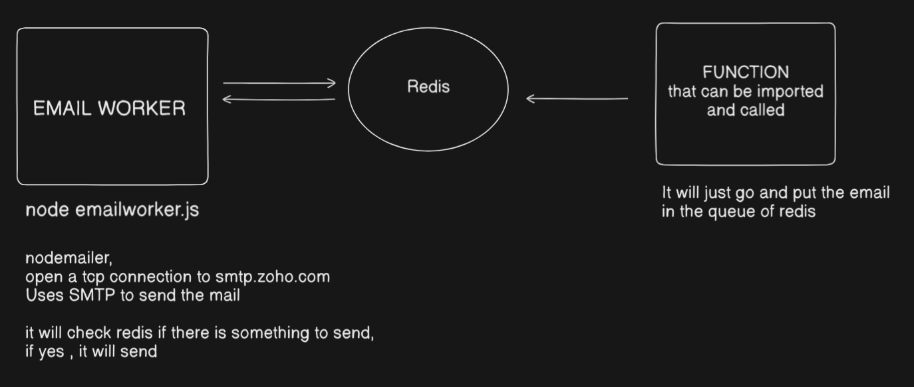

# upSplit

upSplit is a modern expense and contact management web application built with **React**, **Express**, and **MongoDB**.
It allows users to manage contacts, track transactions, settle up amounts, and send reminders — all with a smooth and responsive UI powered by **Framer Motion** and **ShadCN UI**.

---

## ✨ Features

* **Contact Management**

  * Add, search, and filter contacts (`Owe`, `To Receive`, etc.)
 

* **Transactions**

  * Track and update transactions per contact
  * Settlement and reminder functionality
  * Voting system for community posts (planned/optional feature)

* **UI/UX**

  * **Framer Motion** animations for smooth transitions
  * **ShadCN UI DataTable** with filtering, sorting, pagination, and column visibility control
  * Mobile-friendly and responsive layout

* **Backend**

  * REST API built with **Express**
  * Data stored in **MongoDB** 
  * Modular routes for contacts, groups, transactions and analytics

* **Other**

  * Email reminders via BullMQ + Redis (optional worker process)
  * Firebase integration for profile image uploads

---

## 🛠️ Tech Stack

**Frontend**

* React (JSX)
* ShadCN UI
* Lenis
* Rive Animations for custom animations (such as the logo animation and the login page animation)
* Framer Motion
* Axios
* Firebase Storge and Authentication


**Backend**

* Node.js + Express
* MongoDB
* BullMQ + Redis (for background email worker)

**Deployment**

* Microsoft Azure Virtual Machine
* Nginx
* Let's Encrypt Certbot
* Godaddy's Domain Naming System (DNS)
* PM2 Process Manager


---
**Virtual Machine Diagram**





---

## 📂 Project Structure

```
upSplit/
│
├── frontEnd/               # React frontend
│   ├── src/
│   │   ├── components/   # UI components
│   │   ├── pages/        # App pages
│   │   ├── hooks/        # Custom hooks
│   │   ├── utils/        # Helper functions
│   │   └── App.jsx
│   └── package.json
│
├── backEnd/               # Express backend
│   ├── models/           # Mongoose schemas
│   ├── routes/           # API routes
│   ├── controllers/      # Business logic
│   ├── emailworker.js    # BullMQ worker
│   └── server.js
│
├── README.md
└── package.json
```

---

## 🚀 Getting Started

### 1️⃣ Clone the repository

```bash
git clone https://github.com/your-username/upSplit.git
cd upSplit
```

### 2️⃣ Install dependencies

**Frontend**

```bash
cd client
npm install
```

**Backend**

```bash
sudo apt install redis-server
cd server
npm install
```

### 3️⃣ Setup environment variables

Create a `.env` file inside `backEnd/`:

```env
MONGO_URI=your_mongodb_connection_string
JWT_SECRET=your_secret_key
SMTP_PASSKEY= xxxxxx
FIREBASE_API_KEY=your_firebase_api_key
```

---

## ▶️ Running the App

**Start Backend**

```bash
cd server
npm start
```

**Start Frontend**

```bash
cd client
npm run dev
```

**Start Email Worker**

```bash
node emailworker.js ]
```

---

## 📌 Planned Features

* Push notifications
* Advanced analytics dashboard

---
